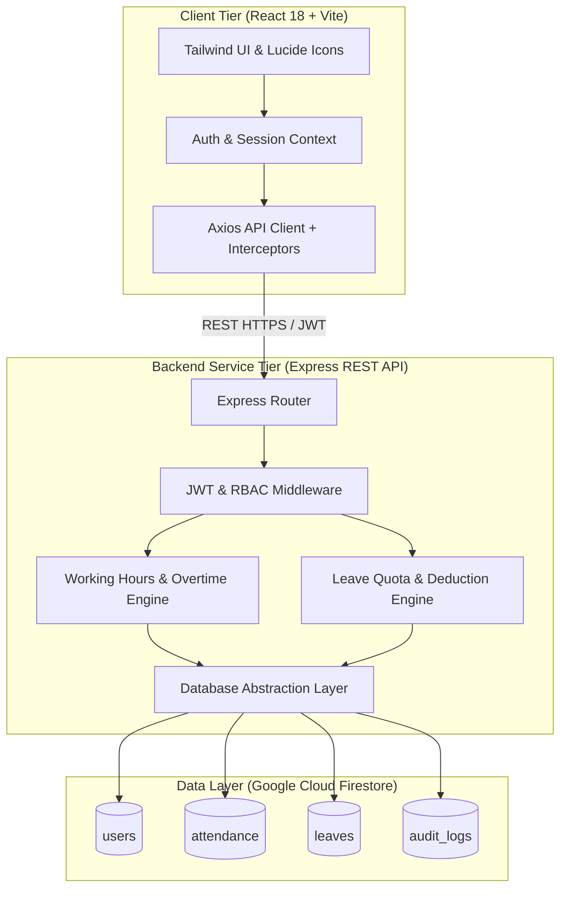
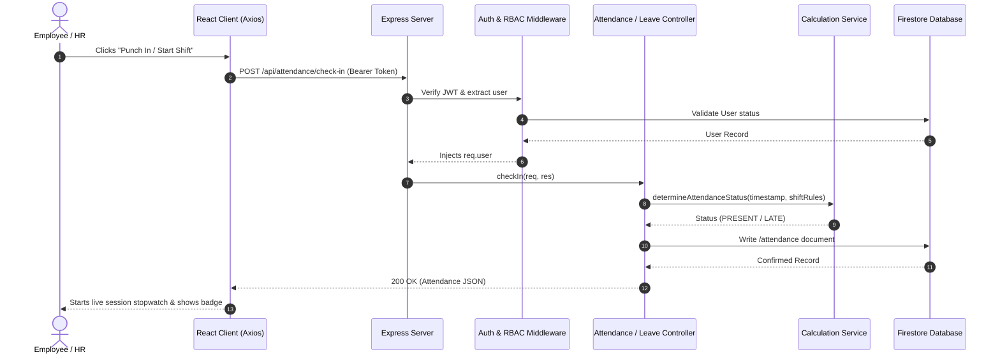

# Chapter 1: Architecture & System Overview

## 1.1 High-Level Architecture Diagram

---

## 1.2 End-to-End Punch Lifecycle

---

## 1.3 Role-Based Access Control (RBAC) Matrix

| Feature / Resource | Route | `EMPLOYEE` | `HR_ADMIN` |
| :--- | :--- | :---: | :---: |
| **Self Attendance Punch In/Out** | `POST /api/attendance/check-in`, `check-out` | Full Access | Full Access |
| **Personal Attendance History** | `GET /api/attendance/my-history` | Own Records | Own Records |
| **Apply for Leave** | `POST /api/leaves/apply` | Own Quota | Own Quota |
| **View Personal Leave Quota** | `GET /api/leaves/my-leaves` | Own Quota | Own Quota |
| **Live Headcount Command Center** | `GET /api/attendance/hr-metrics` | Denied | Full Access |
| **Master Attendance Logs & Filters**| `GET /api/attendance/all-logs` | Denied | Full Access |
| **Manual Attendance Adjustments** | `PUT /api/attendance/adjust/:id` | Denied | Full Access |
| **Approve / Reject Leave Requests**| `POST /api/leaves/:id/approve`, `reject` | Denied | Full Access |
| **Employee Directory Management** | `POST/PUT/DELETE /api/employees` | Denied | Full Access |
| **CSV Export for Payroll** | `GET /api/attendance/all-logs` | Denied | Full Access |
