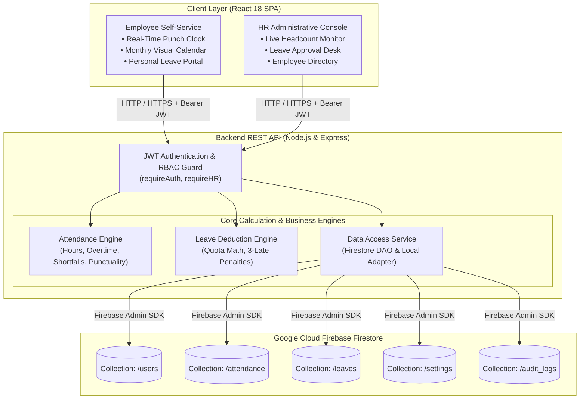
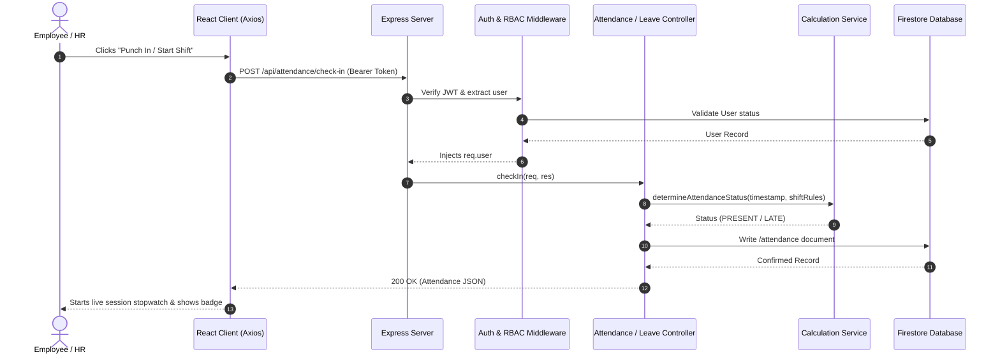

# Chapter 1: Architecture & System Overview

## 1.1 High-Level Architecture

AttendEase is built as a decoupled, multi-tier Web Application composed of an Express.js REST API backend, a Vite + React.js Single Page Application (SPA), and a Google Cloud Firebase Firestore database layer.

---

## 1.2 Core Design Principles

1. **Deterministic Business Rules**: All timestamp math, working hours computations, overtime calculations, and leave deductions execute centrally on the server to prevent client-side clock tampering.
2. **Role-Based Access Control (RBAC)**: Distinct permissions for `HR_ADMIN` (company-wide governance, employee creation, attendance adjustment, leave approvals) and `EMPLOYEE` (self-service punches, personal history, time-off requests).
3. **Dual Persistence Mode**: The application runs natively on live Google Cloud Firestore when configured with a Firebase service account, and features a local JSON persistence fallback for instant out-of-the-box local evaluations.
4. **Sub-second UI Feedback**: Client-side state updates instantly with visual alerts, live stopwatch counters, and toast notifications.

---

## 1.3 Request Lifecycle

