# Chapter 2: Backend Architecture & Implementation

## 2.1 Backend Request Routing Architecture

```mermaid
graph TD
    ClientRequest["HTTP Request (Headers, Body, Bearer Token)"] --> Server["Express Server (src/server.js)"]
    
    Server --> Logger["Morgan Logger & CORS"]
    Logger --> Router{"Express API Router"}
    
    Router -->|/api/auth| AuthRouter["authRoutes.js"]
    Router -->|/api/attendance| AttRouter["attendanceRoutes.js"]
    Router -->|/api/leaves| LeaveRouter["leaveRoutes.js"]
    Router -->|/api/employees| EmpRouter["employeeRoutes.js"]
    
    AttRouter --> AuthGuard["requireAuth Middleware"]
    LeaveRouter --> AuthGuard
    EmpRouter --> HRGuard["requireHR Middleware"]
    
    AuthGuard --> AttCtrl["attendanceController.js"]
    AuthGuard --> LeaveCtrl["leaveController.js"]
    HRGuard --> EmpCtrl["employeeController.js"]
    
    AttCtrl --> AttEngine["attendanceService.js (Hours & OT Engine)"]
    LeaveCtrl --> LeaveEngine["leaveService.js (Leave Quota Engine)"]
    
    AttEngine --> DB["databaseService.js (Firestore DAO)"]
    LeaveEngine --> DB
    EmpCtrl --> DB
    
    DB --> Firestore[("Cloud Firestore")]
```

---

## 2.2 Core Modules & Responsibilities

### 1. Express Server (`src/server.js`)
- Configures CORS, JSON body parsers, Morgan HTTP request logging, and global exception handlers.
- Auto-seeds the database if empty on boot.
- Exposes health check endpoint `/api/health`.

### 2. Authentication & Authorization Middleware (`src/middleware/auth.js`)
- `generateToken(user)`: Generates signed HMAC-SHA256 JWT tokens containing `id`, `email`, `role`, and `name` with a 7-day expiration.
- `requireAuth`: Extracts `Bearer <token>` from HTTP headers, verifies signature, loads the user from Firestore, and injects `req.user`.
- `requireHR`: Validates that `req.user.role === 'HR_ADMIN'`. Returns HTTP `403 Forbidden` if unauthorized.

### 3. Database Abstraction Service (`src/services/databaseService.js`)
Provides unified CRUD and querying operations across collections:
- `getCollection(name)`: Retrieves all documents in a collection.
- `findById(collection, id)`: Fetches a single document by ID.
- `findOne(collection, predicate)`: Queries first matching document.
- `find(collection, predicate)`: Queries all matching documents.
- `create(collection, data)`: Adds document with auto-generated ID and ISO timestamps.
- `update(collection, id, updates)`: Applies atomic field merges and updates `updatedAt`.
- `delete(collection, id)`: Deletes document.

### 4. Attendance Calculation Service (`src/services/attendanceService.js`)
- `calculateWorkingHours(checkInTime, checkOutTime, breakMinutes)`: Computes gross elapsed time, deducts break duration, computes decimal hours, formatted string (e.g. `8h 30m`), overtime exceeding standard 8 hours, and shortfalls.
- `determineAttendanceStatus(checkInTime, workingHours, shiftStart, grace)`: Compares check-in time against shift schedule plus grace period (30 mins) to determine `PRESENT` or `LATE`, and flags `HALF_DAY` if duration is under the full day threshold.
- `calculateMonthlyStats(records)`: Calculates total hours, overtime total, punctuality index score (`%`), attendance rate, and counts.

### 5. Leave Service (`src/services/leaveService.js`)
- `calculateLeaveDays(start, end, isHalfDay)`: Computes workdays (skipping Saturdays & Sundays) between start and end dates.
- `deductLeaveBalance(userId, leaveType, days)`: Deducts requested days from the user's quota. Spills excess deductions to `UNPAID` (Loss of Pay) if balance is exceeded.
- `checkAndApplyLatePenalty(userId, month)`: Checks if late check-in count reached the 3-late threshold, triggering a 0.5-day policy deduction notice.
