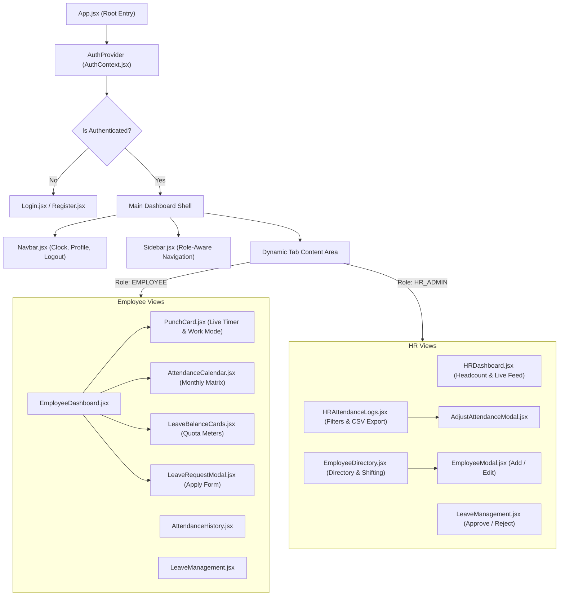

# Chapter 3: Frontend Architecture & Component Guide

## 3.1 Frontend Component Hierarchy

---

## 3.2 Key Components & Functionality

### 1. `AuthContext.jsx`
- Manages global state: `user`, `token`, `loading`.
- Functions: `login(email, password)`, `register(data)`, `logout()`, `refreshProfile()`.
- Synchronizes tokens and user models with `localStorage`.

### 2. `PunchCard.jsx`
- **Active Shift Stopwatch**: Features a `setInterval` timer that computes elapsed seconds from `checkInTime` to `Date.now()` every 1000ms.
- **Progress Gauge**: Calculates percentage towards the 8-hour daily target:
  $$\text{Progress} = \min\left(100, \left\lfloor \frac{\text{Elapsed Seconds}}{8 \times 3600} \times 100 \right\rfloor\right)$$
- **Work Mode Selection**: Allows selecting `OFFICE`, `WORK_FROM_HOME`, or `ON_FIELD`.
- **Break Time Deduction**: Captures break minutes during check-out.

### 3. `AttendanceCalendar.jsx`
- Generates a dynamic 7-column monthly grid.
- Maps Firestore attendance documents by date string (`YYYY-MM-DD`).
- Badges days as `Present` (Emerald), `Late` (Amber), `Half-Day` (Orange), `On Leave` (Blue), or `Off` (Weekend).
- Includes click-to-expand details view showing check-in/out timestamps and notes.

### 4. `LeaveBalanceCards.jsx`
- Visualizes remaining vs. used allowances across **Annual (15)**, **Casual (10)**, **Sick (10)**, and **Unpaid**.
- Displays dynamic progress bars indicating percentage of quota consumed.

### 5. `HRDashboard.jsx`
- Live ops command center displaying:
  - Total Headcount, Present Today, Checked-In Right Now, Late Arrivals, On Leave, and Absent count.
  - Live Floor Feed of ongoing check-ins.
  - Department Attendance Health progress bars.
  - Quick-approval queue for pending leave applications.

### 6. `AdjustAttendanceModal.jsx` & `EmployeeModal.jsx`
- Enables HR administrators to adjust punch timestamps, recalculate hours, override statuses, edit shifts, or create new employees.
