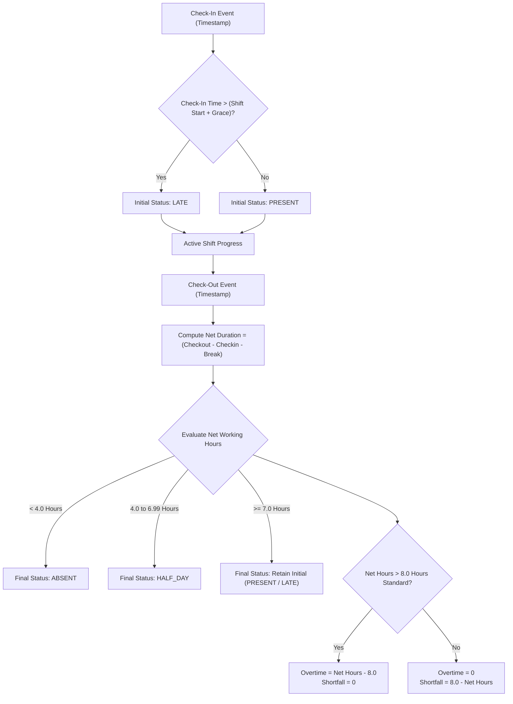

# Chapter 4: Working Hours & Overtime Calculation Engine

## 4.1 Attendance Status Determination Flowchart

---

## 4.2 Working Hours Formula

Working hours are computed using high-precision millisecond timestamps from check-in and check-out events:

$$\text{Gross Minutes} = \left\lfloor \frac{T_{\text{checkout}} - T_{\text{checkin}}}{1000 \times 60} \right\rfloor$$

$$\text{Net Minutes} = \max(0, \text{Gross Minutes} - \text{Break Minutes})$$

$$\text{Duration Hours (Decimal)} = \text{round}\left(\frac{\text{Net Minutes}}{60}, 2\right)$$

$$\text{Formatted Duration} = \left\lfloor \frac{\text{Net Minutes}}{60} \right\rfloor \text{h } (\text{Net Minutes} \bmod 60)\text{m}$$

---

## 4.3 Overtime (OT) & Shortfall Calculations

Given a standard workday requirement of **8.0 hours**:

### Overtime (OT):
$$\text{Overtime Hours} = \begin{cases} \text{Duration Hours} - 8.0 & \text{if } \text{Duration Hours} > 8.0 \\ 0 & \text{otherwise} \end{cases}$$

### Shortfall:
$$\text{Shortfall Hours} = \begin{cases} 8.0 - \text{Duration Hours} & \text{if } \text{Duration Hours} < 8.0 \\ 0 & \text{otherwise} \end{cases}$$

---

## 4.4 Monthly Aggregate Metrics

1. **Punctuality Score (%)**:
   $$\text{Punctuality Score} = \text{round}\left( \frac{\text{Present Days} - \text{Late Days}}{\text{Present Days}} \times 100 \right)$$

2. **Effective Attendance Rate (%)**:
   $$\text{Effective Present Days} = \text{Present Days} + (0.5 \times \text{Half Days})$$
   $$\text{Attendance Rate} = \min\left(100, \text{round}\left( \frac{\text{Effective Present Days}}{\text{Workdays In Month}} \times 100 \right)\right)$$

3. **Average Daily Hours**:
   $$\text{Average Daily Hours} = \text{round}\left( \frac{\text{Total Working Hours}}{\text{Present Days} + \text{Half Days}}, 1 \right)$$
