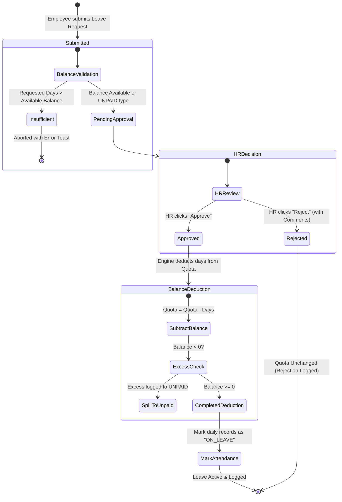

# Chapter 5: Automated Leave Deduction System

## 5.1 Leave Request Lifecycle & Deduction Workflow



---

## 5.2 Leave Quota System

Each employee is allocated dedicated annual quotas:
- **Annual Leave**: 15 Days (Vacations / planned personal leave)
- **Casual Leave**: 10 Days (Short-notice personal reasons)
- **Sick Leave**: 10 Days (Medical illness)
- **Unpaid / Loss of Pay**: Automatically tracks leave taken beyond available paid allowances.

---

## 5.3 Duration & Workday Calculation

When submitting a leave application between `startDate` and `endDate`:
- **Full-Day Mode**: Iterates through each calendar day in the range and counts only business days (Monday through Friday), skipping weekends.
- **Half-Day Mode**: Fixed duration of **0.5 days**.

---

## 5.4 Automated Deduction on HR Approval

When an HR Administrator approves a leave request:
1. **Balance Check & Deduction**:
   - The requested days are deducted from `user.leaveBalances[leaveType]`.
   - If the requested duration exceeds the remaining balance, the balance drops to `0`, and the excess days are logged under `leaveBalances.UNPAID` (Loss of Pay).
2. **Attendance Calendar Integration**:
   - For every workday in the leave range, the system queries or creates an attendance record with:
     ```json
     {
       "status": "ON_LEAVE",
       "notes": "Leave Approved: <leaveType>"
     }
     ```

---

## 5.5 Punctuality Policy Deduction Rules

1. **Consecutive/Accumulated Late Marks**:
   - The engine checks for late punches in the current month.
   - For every **3 late check-ins** accumulated within a calendar month, a **0.5 day policy deduction** notice is triggered.
2. **Half-Day Shortfall**:
   - Working less than 7 hours (but at least 4 hours) is recorded as a `HALF_DAY`, accounting for 0.5 workday in monthly calculations.
