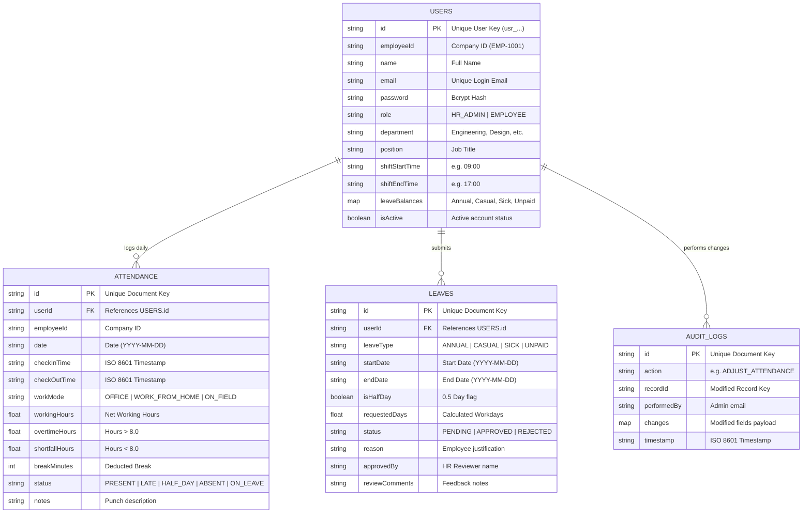

# Chapter 6: Database Schema & Firestore Design

## 6.1 Entity Relationship Diagram

---

## 6.2 Schema Definitions

### 1. Collection: `/users`
Stores employee profiles, credentials, shift parameters, and leave allowances.

| Field | Type | Description |
| :--- | :--- | :--- |
| `id` | `string` | Unique identifier (e.g. `usr_emp_01`) |
| `employeeId` | `string` | Human-readable company ID (e.g. `EMP-1002`) |
| `name` | `string` | Full Name |
| `email` | `string` | Login email (unique, lowercase) |
| `password` | `string` | Bcrypt password hash (10 salt rounds) |
| `role` | `string` | `HR_ADMIN` or `EMPLOYEE` |
| `department` | `string` | Engineering, Design, Product, QA, HR, etc. |
| `position` | `string` | Job Title / Designation |
| `shiftStartTime` | `string` | Scheduled start time in 24h format (e.g. `09:00`) |
| `shiftEndTime` | `string` | Scheduled end time in 24h format (e.g. `17:00`) |
| `joinDate` | `string` | Date of joining (`YYYY-MM-DD`) |
| `isActive` | `boolean` | Account active state |
| `leaveBalances` | `map` | `{ ANNUAL: number, CASUAL: number, SICK: number, UNPAID: number }` |

---

### 2. Collection: `/attendance`
Stores daily attendance records, punch timestamps, and calculated hours.

| Field | Type | Description |
| :--- | :--- | :--- |
| `id` | `string` | Unique document ID |
| `userId` | `string` | Reference to `/users/{userId}` |
| `employeeId` | `string` | Employee ID |
| `employeeName`| `string` | Employee Name |
| `department` | `string` | Department |
| `date` | `string` | Date of shift (`YYYY-MM-DD`) |
| `checkInTime` | `string` | ISO 8601 Timestamp of check-in |
| `checkOutTime`| `string` | ISO 8601 Timestamp of check-out (or `null`) |
| `workMode` | `string` | `OFFICE`, `WORK_FROM_HOME`, or `ON_FIELD` |
| `location` | `string` | Location tag or office floor |
| `workingHours`| `number` | Net hours worked (decimal) |
| `overtimeHours`| `number`| Hours exceeding 8.0 standard shift |
| `shortfallHours`| `number`| Hours under 8.0 standard shift |
| `breakMinutes`| `number` | Break duration deducted from gross time |
| `status` | `string` | `PRESENT`, `LATE`, `HALF_DAY`, `ABSENT`, `ON_LEAVE` |
| `notes` | `string` | Check-in or check-out notes |

---

### 3. Collection: `/leaves`
Stores leave applications and review decisions.

| Field | Type | Description |
| :--- | :--- | :--- |
| `id` | `string` | Unique document ID |
| `userId` | `string` | Reference to `/users/{userId}` |
| `employeeId` | `string` | Employee ID |
| `employeeName`| `string` | Employee Name |
| `department` | `string` | Department |
| `leaveType` | `string` | `CASUAL`, `SICK`, `ANNUAL`, `UNPAID` |
| `startDate` | `string` | Start date (`YYYY-MM-DD`) |
| `endDate` | `string` | End date (`YYYY-MM-DD`) |
| `isHalfDay` | `boolean`| Whether request is for half-day (0.5 day) |
| `requestedDays`| `number`| Total business days requested |
| `reason` | `string` | Employee reason |
| `status` | `string` | `PENDING`, `APPROVED`, `REJECTED`, `CANCELLED` |
| `appliedAt` | `string` | ISO 8601 creation timestamp |
| `approvedBy` | `string` | Reviewer name |
| `reviewComments`| `string`| HR approval/rejection feedback |
